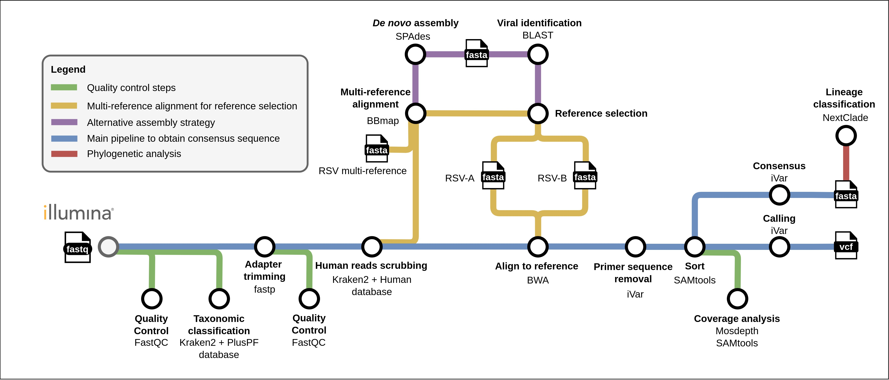
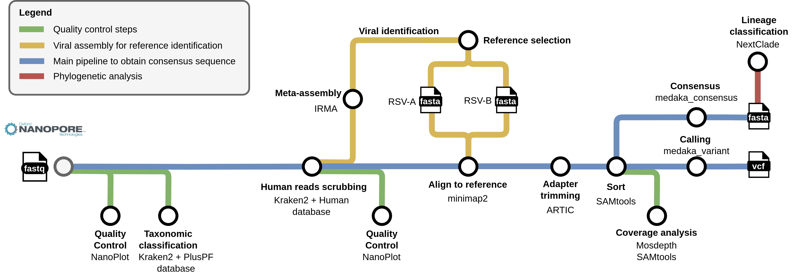

 <a name="nf-rsvpipeline"></a> 
 
<!-- ------------------ HEADER ------------------ -->
<!-- Developed and maintained by Genomics Division
<!-- of the Institute of Technology an Renewable Energy (ITER)
<!-- Tenerife, Canary Islands, SPAIN
<!-- See the "Contact us" section to collaborate with us to growth
<!-- this repository. ;=)

<!-- ------------------ SECTION 1 ------------------ -->
<p align="left">
  <a href="https://github.com/genomicsITER/nf-rsvpipeline" title="Instituto Tecnológico y de Energ&iacute;as Renovables (ITER) / Institute of Technology and Renewable Energy (ITER)">
     
      </a>
</p>

# nf-rsvpipeline

[](https://www.nextflow.io/)
[](https://nf-co.re/)

[](https://docs.conda.io/en/latest/)
[](https://www.docker.com/)
[](https://sylabs.io/docs/)

[](https://x.com/LabCFlores)

A public repository of **Respiratory Syncytial Virus (RSV) genomic surveillance** bioinformatic pipeline maintained by ITER.

## Introduction

**nf-rsvpipeline** automates the processing of Illumina and Oxford Nanopore Technologies (ONT) **amplicon-based** sequencing datasets for viral genome analysis. It integrates multiple tools for quality control, taxonomic classification, reference selection, alignment, consensus generation, and variant calling.

The **nf-rsvpipeline** is built using [Nextflow](https://www.nextflow.io/), following [nf-core](https://nf-co.re) guidelines and templates.

### Respiratory Syncytial Virus genomic surveillance in the Canary Islands

This pipeline is designed for the analysis of RSV whole genomes using short- and long-read sequencing technologies. It is developed as part of the research efforts documented in the following repository:

[`RSV Repository (genomicsITER/RSV)`](https://github.com/genomicsITER/RSV)

The RSV repository contains genomic data, analysis scripts, and additional resources related to the study of Respiratory Syncytial Virus (RSV) cases detected in the Canary Islands between 2022 and 2024. The pipeline in this repository facilitates the automated processing and variant analysis of RSV sequencing datasets.

## Illumina pipeline summary

<h1>
  <picture>
    <source media="(prefers-color-scheme: dark)" srcset="docs/images/Illumina_pipeline_GitHub.jpg">
    
  </picture>
</h1>

1. Quality control of raw reads ([`FastQC`](https://www.bioinformatics.babraham.ac.uk/projects/fastqc/))
2. Taxonomic classification of raw reads ([`Kraken2`](https://github.com/DerrickWood/kraken2))
   * Use PlusPF database ([`Kraken2 databases`](https://benlangmead.github.io/aws-indexes/k2))
3. Adapter trimming ([`fastp`](https://github.com/OpenGene/fastp))
4. Quality control of trimmed reads ([`FastQC`](https://www.bioinformatics.babraham.ac.uk/projects/fastqc/))
5. Remove host reads ([`Kraken2`](https://github.com/DerrickWood/kraken2))
   * Use HumanDB ([`Kraken2 databases`](https://benlangmead.github.io/aws-indexes/k2))
6. Multi-reference alignment to select reference ([`BBMap`](https://sourceforge.net/projects/bbmap/))
   1. Run alternative assembly strategy if previous MSA step failed ([`SPAdes`](https://github.com/ablab/spades))
7. Align reads to the correct reference strain ([`BWA`](https://github.com/lh3/bwa/))
8. Trim adapters before create consensus sequences ([`iVar`](https://github.com/andersen-lab/ivar))
9. Coverage analysis ([`MosDepth`](https://github.com/brentp/mosdepth))
10. Create consensus sequence ([`iVar`](https://github.com/andersen-lab/ivar))
11. Variant-calling ([`iVar`](https://github.com/andersen-lab/ivar))

## ONT pipeline summary

<h1>
  <picture>
    <source media="(prefers-color-scheme: dark)" srcset="docs/images/ONT_pipeline_GitHub.jpg">
    
  </picture>
</h1>

1. Quality control of raw reads ([`NanoPlot`](https://github.com/wdecoster/NanoPlot))
2. Taxonomic classification of raw reads ([`Kraken2`](https://github.com/DerrickWood/kraken2))
   * Use PlusPF database ([`Kraken2 databases`](https://benlangmead.github.io/aws-indexes/k2))
3. Remove host reads ([`Kraken2`](https://github.com/DerrickWood/kraken2))
   * Use HumanDB ([`Kraken2 databases`](https://benlangmead.github.io/aws-indexes/k2))
4. Quality control of dehosted reads ([`NanoPlot`](https://github.com/wdecoster/NanoPlot))
5. Select reference to downstream analysis ([`IRMA`](https://wonder.cdc.gov/amd/flu/irma/index.html))
6. Align reads to the correct reference strain ([`Minimap2`](https://github.com/lh3/minimap2))
7. Trim adapters before create consensus sequences ([`ARTIC`](https://github.com/artic-network/fieldbioinformatics))
8. Coverage analysis ([`MosDepth`](https://github.com/brentp/mosdepth))
9. Create consensus sequence ([`Medaka`](https://github.com/nanoporetech/medaka))
10. Variant-calling ([`Medaka`](https://github.com/nanoporetech/medaka))

## Quick start

> [!NOTE]
> If you are new to Nextflow and nf-core, please refer to [this page](https://nf-co.re/docs/usage/installation) on how to set-up Nextflow. Make sure to [test your setup](https://nf-co.re/docs/usage/introduction#how-to-run-a-pipeline) with `-profile test` before running the workflow on actual data.

1. Install [`Nextflow`](https://www.nextflow.io/docs/latest/getstarted.html#installation) (`>=24.04.2`) before running the pipeline.

2. Make sure to download and set up the **Kraken2 PlusPF** and the **Kraken2 HumanDB** databases from this [`repository`](https://benlangmead.github.io/aws-indexes/k2). Ensure that the database path is correctly set in the `nextflow.config` file using the `kraken2_pluspf_database` and `kraken2_human_database` parameters.

3. Clone the repository:

   ```bash
   git clone https://github.com/genomicsITER/nf-rsvpipeline
   cd nf-rsvpipeline
   ```

4. Input Data Requirements: To run the pipeline, the user must provide sequencing data in the following format:

   * **For Illumina data**: A folder containing paired-end FASTQ files (`_R1.fastq.gz` and `_R2.fastq.gz` for each sample).
   * **For ONT data**: A folder containing single-end FASTQ files (`.fastq.gz`).

5. Run the pipeline:

   For Illumina **paired-end** datasets run the pipeline as follows:

   ```bash
   nextflow run main.nf \
     --indir /path/to/fastq_dir/illumina \
     --outdir results_illumina \
     --platform "illumina" \
     -profile <docker/singularity/conda> \
     -resume
   ```

   For ONT datasets run the pipeline as follows:

   ```bash
   nextflow run main.nf \
     --indir /path/to/fastq_dir/nanopore \
     --outdir results_nanopore \
     --platform "nanopore" \
     -profile <docker/singularity/conda> \
     -resume
   ```

   Additionaly, if you want to run [`pycoQC`](https://github.com/a-slide/pycoQC), you need to add the `--sequencing_summary` parameter:

   ```bash
   nextflow run main.nf \
     --indir /path/to/nanopore/fastq/files \
     --outdir results_nanopore \
     --platform "nanopore" \
     --sequencing_summary sequencing_summary.txt \
     -profile <docker/singularity/conda> \
     -resume
   ```

For further assistance, feel free to open an [issue](https://github.com/genomicsITER/nf-rsvpipeline/issues) in this repository.

## How to cite this work

This work has not been publised yet.

Please cite this repository as: "nf-rsvpipeline (accessed on YYYY-MM-DD)". And do not forget to cite the paper when it becomes available. It is already available as a preprint at [medRxiv](https://www.medrxiv.org/content/10.1101/2025.04.07.25325192v1):

<ul>
  <li><i>A bench-to-data analysis workflow for respiratory syncytial virus whole-genome sequencing with short and long-read approaches</i>. Adrian Gomez-Del Rosario, Adrian Munoz-Barrera, Julia Alcoba-Florez, Diego Garcia-Martinez de Artola, Nora Rodriguez-Garcia,  Jose M. Lorenzo-Salazar, Rafaela Gonzalez-Montelongo,  Carlos Flores, Laura Ciuffreda. [doi](https://doi.org/10.1101/2025.04.07.25325192).</li>
</ul>

## Funding

Cabildo Insular de Tenerife [CGIEU0000219140, CGIAC0000014697 and “Apuestas científicas del ITER para colaborar en la lucha contra la COVID-19”]; by the agreements OA17/008 and OA23/043 with Instituto Tecnológico y de Energías Renovables (ITER) to strengthen scientific and technological education, training, research, development and innovation in Genomics, Epidemiological surveillance based on sequencing, Personalized Medicine and Biotechnology; Fundación Canaria Instituto de Investigación Sanitaria de Canarias [PIFIISC21/37, EMER24/06 and “PROGRAMA INVESTIGO 2023, en el marco del plan de Recuperación, Transformación y Resiliencia – NEXT GENERATION EU”]; Fundación DISA [OA23/074]; Instituto de Salud Carlos III [PI20/00876, CD22/00138, CB06/06/1088], co-funded by the European Regional Development Fund, “A way of making Europe”; from the EU; European Health and Digital Executive Agency [HADEA, 101113109 -RELECOV 2.0]; and by Cabildo Insular de Tenerife and Consejería de Educación, Gobierno de Canarias [A0000014697].

## Update logs

> April 10, 2025. The preprint is alive at medRxiv. Enjoy the reading! ;=)

> April 03, 2025. This repository became fully public.

> February 27, 2025. Illumina and ONT pipelines (v1.0.0).

> January 30, 2025. First commit.
